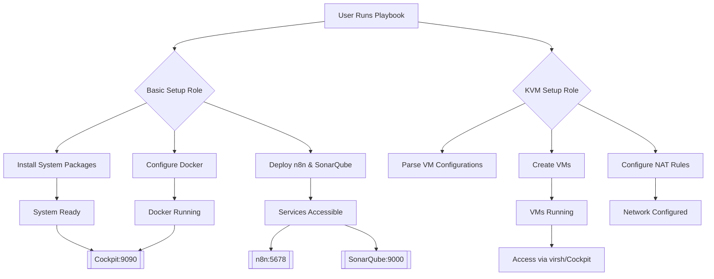

# Ansible Homelab Setup

[](https://opensource.org/licenses/MIT)

An Ansible project for automating homelab infrastructure setup, including system configuration and KVM virtual machine provisioning.

## Quick Start

```bash
git clone https://github.com/kishore1919/ansible_homelab_setup.git
cd ansible_homelab_setup
ansible-galaxy collection install community.libvirt

# Basic system setup
ansible-playbook main.yml --tags basic_setup

# Virtual machine setup with custom configuration
ansible-playbook main.yml --tags kvm_setup -e @custom-underlay.yaml
```

## Table of Contents

- [Features](#features)
- [Project Structure](#project-structure)
- [Requirements](#requirements)
- [Installation](#installation)
- [Usage](#usage)
- [Configuration](#configuration)
- [Customization](#customization)
- [Troubleshooting](#troubleshooting)
- [License](#license)

## Features

### 🏗️ Basic Setup
- **Package Management**: Automated installation of system packages including Docker and KVM
- **Docker Setup**: Complete Docker and Docker Compose configuration
- **Service Deployment**: Ready-to-use n8n and SonarQube containers
- **Web Management**: Cockpit interface for system monitoring

### 💻 KVM Virtualization
- **Multi-Source Images**: Support for local files, HTTP/HTTPS URLs, and Google Cloud Storage
- **Efficient Storage**: Per-VM overlay disks on qcow2 base images
- **Network Management**: Automated NAT rules and network connections
- **Flexible Resources**: Configurable CPU, memory, and disk allocation

## Requirements

| Component | Requirements |
|-----------|-------------|
| **Ansible Core** | 2.9+ with become/sudo support |
| **Target System** | Ubuntu 22.04 LTS or newer |
| **Basic Setup** | Internet access for package downloads |
| **KVM Setup** | Hardware virtualization support |
| **Dependencies** | `community.libvirt` collection, `gsutil` (for GCS), `iptables` |

## Installation

### 1. Clone Repository
```bash
git clone https://github.com/kishore1919/ansible_homelab_setup.git
cd ansible_homelab_setup
```

### 2. Install Dependencies
```bash
# Install required Ansible collection
ansible-galaxy collection install community.libvirt

# For Google Cloud Storage support (optional)
pip install gsutil
```

### 3. Configure Inventory
Create or edit `inventory.ini`:
```ini
[localhost]
127.0.0.1 ansible_connection=local
```

## Usage

### Running the Playbooks

#### Basic System Setup
Configure your homelab server with essential packages and Docker:
```bash
ansible-playbook -i inventory.ini main.yml
```

#### KVM Virtual Machine Setup
Create and configure virtual machines using the vars_files configuration:
```bash
# Place your custom-underlay.yaml in the project root
ansible-playbook -i inventory.ini main.yml
```

#### Verbose Output (for debugging)
```bash
ansible-playbook -i inventory.ini main.yml -vvv
```

## Project Structure

```
ansible_homelab_setup/
├── main.yml                          # Main orchestration playbook
├── README.md                         # This documentation
├── .gitignore                        # Git ignore rules
├── group_vars/
│   └── all.yml                       # Global Ansible variables
├── basic_setup/                      # Basic system setup role
│   ├── defaults/
│   │   └── main.yml                  # Default configuration variables
│   ├── vars/
│   │   └── main.yml                  # Docker compose configuration
│   ├── tasks/
│   │   ├── main.yml                  # Main task orchestration
│   │   ├── install_packages.yml      # Package installation
│   │   └── configure_docker.yml      # Docker setup and configuration
│   └── files/                        # Docker compose files
│       ├── n8n-docker-compose.yml    # n8n service configuration
│       └── sonarqube-docker-compose.yml # SonarQube service configuration
└── kvm_setup/                        # KVM virtualization role
    ├── defaults/
    │   └── main.yml                  # Currently basic_setup defaults (needs update)
    ├── tasks/
    │   ├── main.yml                  # Main VM orchestration
    │   ├── build_vm_list.yml         # Parse VM configuration
    │   ├── create_vm_single.yml      # Single VM provisioning
    │   ├── configure_nat.yml         # NAT networking setup
    │   └── configure_connections.yml # Inter-VM networking
    └── README.md                     # KVM-specific documentation
```

## Configuration

### Basic Setup Configuration

The basic setup role automatically installs:
- System packages (git, python3-pip, curl, etc.)
- Docker CE and Docker Compose plugin
- Cockpit web management interface
- KVM virtualization packages

Configure system settings in `basic_setup/defaults/main.yml`:

```yaml
basic_setup_users: []                    # Users to create
basic_setup_packages: []                 # Additional system packages
basic_setup_timezone: "UTC"              # System timezone
basic_setup_enable_ssh: true             # Enable SSH service
basic_setup_ssh_port: 22                 # SSH port configuration
basic_setup_manage_firewall: false       # Enable firewall management
basic_setup_allow_passwordless_sudo: false # Passwordless sudo settings
```

### KVM Setup Configuration

VM definitions use the `cncloud::custom::vm_data` structure in your `custom-underlay.yaml` file:

```yaml
cncloud::custom::vm_data:
  web-servers:
    web-server-01:
      image_src: "gs://mybucket/ubuntu-server.qcow2"
      image_dest: "/var/lib/libvirt/images/web-server.qcow2"
      memory: 2048
      vcpu: 2
      vm_info:
        type: "ubuntu"
        version: "22.04"
      interfaces:
        int1:
          ipaddress: "192.168.122.10"
          netmask: "255.255.255.0"
      natrules:
        http:
          host_port: 8080
          nat_port: 80
      commands:
        - "systemctl enable nginx"
```

### Global Variables

Configure inventory-wide settings in `group_vars/all.yml`:

```yaml
custom_underlay_path: /etc/puppet/hiera/data/role/custom/custom-underlay.yaml
```

## Docker Services

The project includes pre-configured Docker Compose services:

### n8n (Workflow Automation)
- **Port**: 5678
- **Default Setup**: Requires initial configuration
- **Volume**: Persistent data storage

### SonarQube (Code Quality)
- **Port**: 9000
- **Database**: PostgreSQL (included)
- **Default Credentials**: admin/admin

Services are automatically deployed via the `basic_setup` role.

## Customization

### Add Custom Packages

Update `basic_setup/tasks/install_packages.yml` to include additional packages in the installation lists.

### Add New Docker Services

1. Create a new `docker-compose.yml` file in `basic_setup/files/`
2. Add the filename to `basic_setup_compose_files` list in `basic_setup/vars/main.yml`
3. Re-run the basic_setup role

### Customize VM Templates

Create custom VM configurations in your `custom-underlay.yaml`:

```yaml
cncloud::custom::vm_data:
  database-servers:
    postgres-01:
      image_src: "https://cloud-images.ubuntu.com/jammy/current/jammy-server-cloudimg-amd64.img"
      image_dest: "/var/lib/libvirt/images/postgres.qcow2"
      memory: 4096
      vcpu: 2
      vm_info:
        type: "ubuntu"
      interfaces:
        int1:
          ipaddress: "192.168.122.20"
          netmask: "255.255.255.0"
      natrules:
        postgres:
          host_port: 5432
          nat_port: 5432
```

## Troubleshooting

### Common Issues & Solutions

| Issue | Symptom | Solution |
|-------|---------|----------|
| **Permission Denied** | `become: yes` issues | Verify sudo access: `sudo -l` |
| **Missing Collections** | `collection not found` | Run: `ansible-galaxy collection install community.libvirt` |
| **VM Creation Fails** | Image download or disk creation errors | Check disk space and network connectivity |
| **Docker Problems** | Service won't start | Check: `systemctl status docker` |
| **KVM Not Available** | Hardware virtualization errors | Ensure KVM is enabled in BIOS/UEFI |

### Debugging Commands

```bash
# Detailed playbook execution
ansible-playbook -i inventory.ini main.yml -vvv

# Check role syntax
ansible-playbook --syntax-check main.yml

# Test connectivity
ansible -i inventory.ini -m ping localhost

# Dry run (shows what would change)
ansible-playbook -i inventory.ini main.yml --check

# List available tags
ansible-playbook --list-tags main.yml
```

### Log Files & Diagnostics

```bash
# System logs
journalctl -u libvirtd
systemctl status libvirtd

# VM information
virsh list --all
virsh dominfo <vm_name>

# Network diagnostics
virsh net-list
iptables -L -n -v
```

## Access Information

### Web Interfaces
- **Cockpit Management**: `https://<host-ip>:9090`
- **SonarQube**: `http://<host-ip>:9000`
- **n8n Workflows**: `http://<host-ip>:5678`

### Virtual Machines
- **Network**: Default libvirt network (192.168.122.0/24)
- **Management**: Use `virsh` commands or Cockpit interface

### VM Management Commands
```bash
# List VMs
virsh list --all

# Start/stop VMs
virsh start <vm-name>
virsh shutdown <vm-name>

# Access VM console
virsh console <vm-name>
```

## Getting Help

1. Check the [KVM README](kvm_setup/README.md) for virtualization-specific issues
2. Review Ansible documentation for [playbooks](https://docs.ansible.com/ansible/latest/playbook_guide/)
3. Check libvirt [documentation](https://libvirt.org/docs.html) for virtualization issues

## License

This project is licensed under the MIT License.

## Notes

- The `custom-underlay.yaml` file should be placed in the project root directory
- VMs are created with unique overlay disks for efficient storage usage
- NAT rules are automatically configured for VM network access
- The project includes idempotency checks to prevent duplicate resource creation

## Flow Diagram



The diagram illustrates the complete workflow:
1. **User Execution**: Triggers the Ansible playbook
2. **Basic Setup Role**: Handles system preparation and Docker services
3. **KVM Setup Role**: Manages virtual machine provisioning and networking
4. **Final State**: Accessible web services and virtual machines ready for use
