# Ansible Homelab Setup

This repository contains a comprehensive Ansible-based automation solution for setting up and managing a homelab environment.

## 🚀 Overview

This project automates the setup and management of a complete homelab environment with three core components:

| Component | Purpose | Key Features |
|-----------|---------|--------------|
| **basic_setup**   | System configuration   | Package installation, Docker setup, user management |
| **kvm_setup**     | Virtualization         | KVM hypervisor, VM creation, networking, NAT configuration |
| **appframework**  | Application deployment | Multi-VM orchestration, container services, service discovery |

---

## 🧱 System Architecture

```mermaid
graph TB
    subgraph Ansible["Ansible Control"]
        Playbook["main.yml<br/>Orchestration Playbook"]
        Inventory["inventory.ini<br/>Host Definitions"]
        GroupVars["group_vars/all.yml<br/>Global Variables"]
    end
    
    subgraph Roles["Ansible Roles"]
        BasicSetup["<b>basic_setup</b><br/>System Configuration<br/>━━━━━━<br/>• Packages<br/>• Docker<br/>• KVM Setup<br/>• Users/Groups"]
        KVMSetup["<b>kvm_setup</b><br/>Virtualization<br/>━━━━━━<br/>• KVM Hypervisor<br/>• VM Creation<br/>• Networking<br/>• NAT Rules"]
        AppFramework["<b>appframework</b><br/>Applications<br/>━━━━━━<br/>• Docker Compose<br/>• Services<br/>• Multi-VM Orch<br/>• Containers"]
    end
    
    subgraph Targets["Target Systems"]
        BasicServers["basic_setup_servers<br/>System Hosts"]
        KVMServers["kvm_servers<br/>Virtualization Hosts"]
        AppServers["app_servers<br/>Application Hosts"]
    end
    
    subgraph Data["Configuration Data"]
        CustomUnderlay["custom-underlay.yaml<br/>VM Definitions"]
        VarFiles["Role Variables<br/>defaults/ & vars/"]
    end
    
    Playbook --> BasicSetup
    Playbook --> KVMSetup
    Playbook --> AppFramework
    Inventory --> Playbook
    GroupVars --> Playbook
    
    BasicSetup --> BasicServers
    KVMSetup --> KVMServers
    AppFramework --> AppServers
    
    KVMSetup --> CustomUnderlay
    KVMSetup --> VarFiles
    AppFramework --> VarFiles
    BasicSetup --> VarFiles
    
    style Playbook fill:#4A90E2,stroke:#2E5C8A,color:#fff
    style BasicSetup fill:#7ED321,stroke:#5A9B1E,color:#fff
    style KVMSetup fill:#F5A623,stroke:#C47F1A,color:#fff
    style AppFramework fill:#BD10E0,stroke:#8B0A96,color:#fff
````

---

## 🔁 Component Execution Flow

```mermaid
graph LR
    User["👤 User"]
    Ansible["🔧 Ansible"]
    
    subgraph "Execution Phase"
        E1["1️⃣ Basic Setup<br/>System Init"]
        E2["2️⃣ KVM Setup<br/>VMs Creation"]
        E3["3️⃣ App Framework<br/>Services Deploy"]
    end
    
    subgraph "Target State"
        S1["Configured<br/>System"]
        S2["Running<br/>VMs"]
        S3["Active<br/>Services"]
    end
    
    User -->|"ansible-playbook main.yml"| Ansible
    Ansible --> E1
    E1 --> S1
    E1 --> E2
    E2 --> S2
    E2 --> E3
    E3 --> S3
    
    style User fill:#FFD700,stroke:#DAA520
    style E1 fill:#7ED321,stroke:#5A9B1E,color:#fff
    style E2 fill:#F5A623,stroke:#C47F1A,color:#fff
    style E3 fill:#BD10E0,stroke:#8B0A96,color:#fff
    style S1 fill:#50E3C2,stroke:#2BA892,color:#000
    style S2 fill:#50E3C2,stroke:#2BA892,color:#000
    style S3 fill:#50E3C2,stroke:#2BA892,color:#000
```

---

## 🖥️ KVM VM Provisioning Workflow

```mermaid
graph TD
    Start["Start KVM Setup"] --> ParseVM["Parse custom-underlay.yaml<br/>build_vm_list.yml"]
    ParseVM --> VMList["Extract VM List<br/>from cncloud__custom__vm_data"]
    
    VMList --> Loop{"For Each VM<br/>in List"}
    
    Loop -->|"VM Config"| Download["Download Image<br/>GCS or Local"]
    Download --> Convert["Convert to QCOW2<br/>Base Image"]
    Convert --> Overlay["Create Per-VM<br/>Overlay Disk<br/>create_vm_single.yml"]
    
    Overlay --> CheckExist{"VM<br/>Exists?"}
    CheckExist -->|"No"| VirtInstall["Execute virt-install<br/>Create VM"]
    CheckExist -->|"Yes"| StartVM["Start VM<br/>if Stopped"]
    
    VirtInstall --> Config["Configure<br/>Networking"]
    StartVM --> Config
    
    Config --> NAT{"NAT Rules<br/>Defined?"}
    NAT -->|"Yes"| ConfigNAT["Configure DNAT Rules<br/>iptables<br/>configure_nat.yml"]
    NAT -->|"No"| Connections
    
    ConfigNAT --> Connections{"VM Connections<br/>Defined?"}
    Connections -->|"Yes"| ConfigConn["Configure VM-to-VM<br/>Connections<br/>configure_connections.yml"]
    Connections -->|"No"| Next["Next VM"]
    ConfigConn --> Next
    
    Next --> Loop
    Loop -->|"All VMs Done"| Complete["✅ VMs Ready"]
    
    style Start fill:#4A90E2,stroke:#2E5C8A,color:#fff
    style ParseVM fill:#F5A623,stroke:#C47F1A,color:#fff
    style VMList fill:#F5A623,stroke:#C47F1A,color:#fff
    style Download fill:#7ED321,stroke:#5A9B1E,color:#fff
    style Convert fill:#7ED321,stroke:#5A9B1E,color:#fff
    style Overlay fill:#7ED321,stroke:#5A9B1E,color:#fff
    style VirtInstall fill:#BD10E0,stroke:#8B0A96,color:#fff
    style ConfigNAT fill:#BD10E0,stroke:#8B0A96,color:#fff
    style ConfigConn fill:#BD10E0,stroke:#8B0A96,color:#fff
    style Complete fill:#50E3C2,stroke:#2BA892,color:#000
```



---

## 📦 Application Framework Deployment

```mermaid
graph TD
    Start["Start App Framework"] --> CheckMultiVM{"multi_vm<br/>Variable"}
    
    CheckMultiVM -->|"multi_vm = 'yes'"| MultiVM["Multi-VM Setup<br/>multivm.yml"]
    CheckMultiVM -->|"multi_vm != 'yes'"| SingleVM["Single-VM Setup<br/>singlevm.yml"]
    
    subgraph MultiVM_Flow["Multi-VM Flow"]
        M1["Parse Multi-VM Config<br/>parse_multivm_child_docker_env.py"]
        M2["Load Compose File<br/>multivm-child-docker-compose.yml"]
        M3["Deploy Containers<br/>docker_compose_v2"]
        M4["Configure Multi-VM<br/>Networking & Hosts"]
        M5["Setup Cron Jobs<br/>IP Management"]
        
        M1 --> M2 --> M3 --> M4 --> M5
    end
    
    subgraph SingleVM_Flow["Single-VM Flow"]
        S1["Get VM Data<br/>from Variables"]
        S2["Detect SD-WAN<br/>Configuration"]
        S3["Load Compose File<br/>base or sdwan-docker-compose.yml"]
        S4["Deploy Containers<br/>docker_compose_v2"]
        S5["Configure Services<br/>Hosts & Facter"]
        
        S1 --> S2 --> S3 --> S4 --> S5
    end
    
    MultiVM --> M1
    SingleVM --> S1
    
    M5 --> Finalize["Add Docker Apps to Facter<br/>Create Device List"]
    S5 --> Finalize
    
    Finalize --> HostsFile["Update /etc/hosts<br/>VM & Service IPs"]
    HostsFile --> Complete["✅ Services Running"]
    
    style Start fill:#4A90E2,stroke:#2E5C8A,color:#fff
    style M3 fill:#BD10E0,stroke:#8B0A96,color:#fff
    style S4 fill:#BD10E0,stroke:#8B0A96,color:#fff
    style Complete fill:#50E3C2,stroke:#2BA892,color:#000
    style Finalize fill:#7ED321,stroke:#5A9B1E,color:#fff
```



---

## 🗂️ File & Variable Dependency Graph


---

## 📋 Prerequisites

### System Requirements

* **OS**: Ubuntu 20.04+ / other Debian-based Linux
* **Ansible**: Version 2.9+
* **Privileges**: Root/sudo access required
* **RAM**: Minimum 8 GB (16 GB+ recommended)
* **Storage**: 100 GB+ free space
* **CPU**: Virtualization support (Intel VT-x / AMD-V)

### Required Software

```bash
# Install Ansible
sudo apt update
sudo apt install ansible

# Install required collections
ansible-galaxy collection install community.libvirt community.docker
```

---

## 🏗️ Project Structure

```text
ansible_homelab_setup/
├── main.yml                           # Main orchestration playbook
├── inventory.ini.example              # Inventory template
├── README.md                          # This file
│
├── group_vars/
│   └── all.yml                        # Global variables
│
├── basic_setup/                       # System setup role
│   ├── tasks/
│   │   ├── main.yml
│   │   └── install_packages.yml
│   ├── defaults/main.yml
│   └── vars/main.yml
│
├── kvm_setup/                         # Virtualization role
│   ├── tasks/
│   │   ├── main.yml
│   │   ├── build_vm_list.yml
│   │   ├── create_vm_single.yml
│   │   ├── configure_nat.yml
│   │   └── configure_connections.yml
│   ├── defaults/main.yml
│   └── README.md
│
└── appframework/                      # Application framework role
    ├── tasks/
    │   ├── main.yml
    │   ├── singlevm.yml
    │   └── multivm.yml
    └── defaults/main.yml
```

---

## ⚡ Quick Start

### 1. Clone and Initialize

```bash
# Clone the repository
git clone <repository-url>
cd ansible_homelab_setup

# Create inventory from template
cp inventory.ini.example inventory.ini
```

### 2. Configure Inventory

Edit `inventory.ini` for your environment:

```ini
[homelab_servers]
localhost ansible_connection=local ansible_user=root

[basic_setup_servers]
localhost

[kvm_servers]
localhost

[app_servers]
localhost
```

### 3. Run Setup

```bash
# Full setup
ansible-playbook main.yml -i inventory.ini

# Specific component
ansible-playbook main.yml -i inventory.ini --tags "basic_setup"
```

---

## 🔧 Components

### 1. Basic Setup (`basic_setup/`)

Initializes the system with required packages and configurations.

**Features:**

* System package management (APT)
* Docker & Docker Compose installation
* User configuration and Docker group permissions
* Service enablement (Cockpit, SSH)
* KVM package installation

**Key Tasks (examples):**

* Update APT cache
* Disable unattended upgrades (optional, configurable)
* Install prerequisites and Docker
* Configure user Docker access
* Install KVM packages

**Configuration Variables (example):**

```yaml
basic_setup_timezone: "UTC"
basic_setup_enable_ssh: true
basic_setup_ssh_port: 22
basic_setup_ntp_servers:
  - pool.ntp.org
```

---

### 2. KVM Setup (`kvm_setup/`)

Manages KVM virtualization and VM provisioning.

**Features:**

* KVM hypervisor configuration
* VM creation from custom definitions
* Per-VM overlay disk management
* NAT networking configuration
* Network connections between VMs
* Google Cloud Storage image support

**Key Tasks:**

* `build_vm_list.yml` — Parse custom-underlay VM definitions
* `create_vm_single.yml` — Create individual VMs
* `configure_nat.yml` — Configure NAT rules
* `configure_connections.yml` — Configure VM networking

See `kvm_setup/README.md` for detailed documentation.

---

### 3. Application Framework (`appframework/`)

Orchestrates containerized application deployment.

**Features:**

* Single-VM and multi-VM deployments
* Docker Compose integration (v2 plugin)
* Service configuration
* Device list management
* `/etc/hosts` file configuration
* SD-WAN support detection

**Configuration Variables:**

```yaml
multi_vm: "no"              # Set to "yes" for multi-VM setup
vm_data: {}                 # VM definitions (optional)
scripts_dir: /opt/scripts
compose_dir: /opt/compose
```

**Single-VM Setup:**

```bash
ansible-playbook main.yml -i inventory.ini --tags "appframework" \
  -e "multi_vm=no"
```

**Multi-VM Setup:**

```bash
ansible-playbook main.yml -i inventory.ini --tags "appframework" \
  -e "multi_vm=yes"
```

---

## ⚙️ Configuration

### Inventory Setup (Local Example)

```ini
[homelab_servers]
localhost ansible_connection=local ansible_user=root

[basic_setup_servers]
localhost

[kvm_servers]
localhost

[app_servers]
localhost
```

### Global Variables

Edit `group_vars/all.yml`:

```yaml
---
# Path to custom VM definitions (if using Puppet/Hiera structure)
custom_underlay_path: /etc/puppet/hiera/data/role/custom/custom-underlay.yaml
```

---

## 🎯 Usage

### Full System Setup

```bash
# Complete setup with all components
ansible-playbook main.yml -i inventory.ini
```

### Component-Specific Setup

```bash
# Basic system setup only
ansible-playbook main.yml -i inventory.ini --tags "basic_setup"

# KVM virtualization only
ansible-playbook main.yml -i inventory.ini --tags "kvm_setup"

# Application framework only
ansible-playbook main.yml -i inventory.ini --tags "appframework"
```

### Dry Run

```bash
# Preview changes without applying
ansible-playbook main.yml -i inventory.ini --check
```

### Verbose Output

```bash
# Detailed execution information
ansible-playbook main.yml -i inventory.ini -vv
```

### Syntax Check

```bash
# Validate playbook syntax
ansible-playbook main.yml -i inventory.ini --syntax-check
```

---

## 🆕 Adding a New Role

### 1. Create Role Structure

```bash
mkdir -p new_role/{tasks,handlers,templates,files,vars,defaults,meta}
cd new_role
```

### 2. Create Task File

`tasks/main.yml`:

```yaml
---
- name: Task description
  ansible.builtin.debug:
    msg: "Task execution"
```

### 3. Create Defaults

`defaults/main.yml`:

```yaml
---
# Default variables
new_role_enabled: true
new_role_packages: []
```

### 4. Optional: Handlers

`handlers/main.yml`:

```yaml
---
- name: service restart handler
  ansible.builtin.systemd:
    name: service_name
    state: restarted
  become: yes
```

### 5. Register in `main.yml`

```yaml
- name: New Role
  hosts: target_servers
  become: yes
  tags: new_role
  roles:
    - new_role
```

### 6. Update Inventory

```ini
[new_role_servers]
localhost ansible_connection=local
```

### 7. Test

```bash
# Syntax check
ansible-playbook main.yml --syntax-check

# Dry run
ansible-playbook main.yml --tags "new_role" --check

# Execute
ansible-playbook main.yml --tags "new_role"
```

---

## 🛠️ Troubleshooting

### Connectivity Issues

```bash
# Test Ansible connectivity
ansible all -i inventory.ini -m ping

# Test specific host
ansible localhost -i inventory.ini -m ping

# Check host variables
ansible-inventory -i inventory.ini --host localhost
```

### KVM Issues

```bash
# Verify KVM support
sudo kvm-ok

# Check libvirt daemon
sudo systemctl status libvirtd

# List virtual machines
virsh list --all

# Check VM details
virsh dominfo vm_name

# View libvirt logs
sudo journalctl -u libvirtd -n 50
```

### Docker Issues

```bash
# Check Docker service
sudo systemctl status docker

# Verify Docker installation
docker --version

# Check user Docker permissions
groups $USER

# Test Docker without sudo (after relogin)
docker ps
```

### Ansible Issues

```bash
# Validate playbook syntax
ansible-playbook main.yml --syntax-check

# Check role dependencies
ansible-galaxy role list

# Verbose execution
ansible-playbook main.yml -vvv

# Check all inventory data
ansible-inventory -i inventory.ini --list
```

### Permission Issues

```bash
# If user not in docker group
sudo usermod -aG docker $USER
newgrp docker

# Verify docker group membership
id $USER

# Grant sudoers access (if needed)
sudo visudo  # Add: username ALL=(ALL) NOPASSWD: ALL
```

---

## 📊 Monitoring & Logs

### System Monitoring

```bash
# Check system resources
free -h
df -h
htop

# Service status
systemctl status docker
systemctl status libvirtd
systemctl status cockpit
```

### Log Locations

```text
Ansible logs:        /var/log/ansible.log   (if configured)
Docker logs:         journalctl -u docker
Libvirt logs:        journalctl -u libvirtd
Cockpit logs:        journalctl -u cockpit
System logs:         /var/log/syslog
```

### Viewing Logs

```bash
# Recent logs
journalctl -n 50

# Follow logs
journalctl -f

# Service-specific logs
journalctl -u service_name -n 50

# Ansible debug
ansible-playbook main.yml -vvv
```